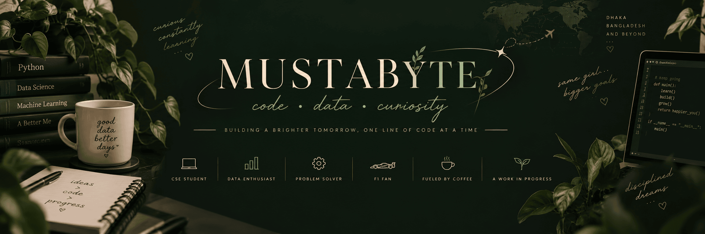

<p align="center">
  
</p>
<h2 align="center">Hey, I'm Mustab 🌿</h2>

<p align="center">
  <b>Curious mind. Analytical heart. Always building.</b><br>
  Exploring the intersection of data, machine learning & real-world problems.
</p>
<br>
<h2 align="center">🌿 about_me.py</h2>

```python
class Mustab:
    def __init__(self):
        self.name = "Mustabshera Binte Junayed"
        self.role = "CSE Student"
        self.goal = "Data Scientist"
        self.interests = ["Data Science", "Machine Learning", "Formula 1"]
        self.motto = "Learn. Build. Grow."

   def current_status(self):
    return "Learning, building & probably debugging ☕"
```
<br>

<h2 align="center">My Little Toolbox 🛠</h2>
<p align="center">
  
  
  

</p>

<br>

<h2 align="center">Currently Brewing ☕</h2>

<p align="center">
  
  
  
  
</p>

<br>

<h2 align="center">On My Radar 🧭</h2>

<p align="center">
  
  
  
  
  
  
</p>
